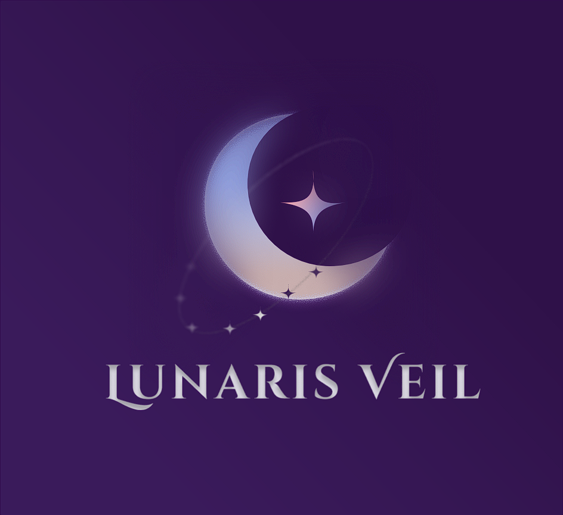

<!-- ⚡ ULTRA PREMIUM • FUTURISTIC • BLUE–PURPLE GRADIENT -->

---

---

## ⋆.˚✮ Identity ✮˚.⋆
<table>
<tr>
<td align="center" width="160">

</td>
<td>

**Zharvian**  
Developer focused on **high-quality digital systems**, elegant interfaces, and scalable architectures.  
Driven by precision, aesthetics, and long-term maintainability.

🔹 Web • Mobile • Game  
🔹 UI Engineering • Logic Design • System Flow

</td>
</tr>
</table>

---

## ⋆༺𓆩 Core Technologies 𓆪༻⋆

---

## 𓂃˖˳·˖ ִֶָ ⋆ Developer Principles ⋆ ִֶָ˖·˳˖𓂃 ִֶָ
<table>
<tr>
<td>🧩</td><td><b>System Thinking</b></td><td>Every feature is part of a larger architecture</td>
</tr>
<tr>
<td>🎨</td><td><b>Visual Discipline</b></td><td>Design must communicate function</td>
</tr>
<tr>
<td>⚡</td><td><b>Efficiency First</b></td><td>Clean logic, minimal overhead</td>
</tr>
<tr>
<td>🔒</td><td><b>Reliability</b></td><td>Stable systems over flashy hacks</td>
</tr>
</table>

---

## ﮩ٨ـﮩﮩ٨ـ Community & Network ﮩ٨ـﮩﮩ٨ـ
<table>
<tr>
<td width="60"></td>
<td>
<b>Community</b> 
Komunitas Gaming Indonesia yg masih merintis :)
</td>
<td align="right"><a href="https://discord.gg/jnYpjWmjdz">Join</a></td>
</tr>
</table>

---

## ⫘⫘⫘ GitHub Analytics ⫘⫘⫘

---

## ✩₊˚.⋆ Featured Focus ⋆⁺₊✧
<table>
<tr>
<td width="33%">
<b>🚀 Innovation</b> 
Building systems that reduce complexity and increase clarity.
</td>
<td width="33%">
<b>🛠 Engineering</b> 
Strong foundations with scalable logic and structure.
</td>
<td width="33%">
<b>🎮 Creativity</b> 
Blending logic with expressive digital experiences.
</td>
</tr>
</table>

---

## ────────────୨ Collaborations ৎ────────────

---

  

---

[;>+loading.modules...;>+identity.confirmed;>+execute.with.elegance)](https://git.io/typing-svg)

---

